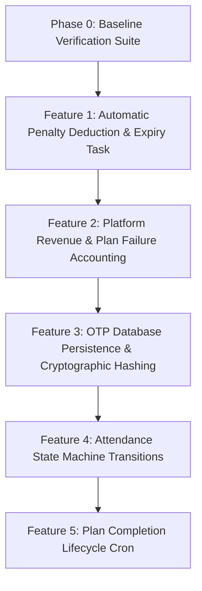

# WakeLock: Implementation Status & Feature Roadmap

**Version:** 4.0 (Locked Architecture Tracking)  
**Date:** March 2026 / July 2026 Audit  
**Stack:** FastAPI · PostgreSQL · Redis · Celery · Telegram Bot API  

---

## 1. Executive Summary

This document serves as the master tracking record for the **WakeLock Backend Accountability Engine**. A comprehensive audit of the codebase against [WakeLock.txt](file:///c:/Users/krish/OneDrive/Pictures/Projects/wakelock/WakeLock.txt) reveals that approximately **75% of the core architecture** has been implemented. 

The foundational database schema, virtual wallet ledger, Telegram command interface, and basic alarm/OTP scheduling are functional. However, **five critical backend enforcement mechanisms** (such as automated penalty deductions on expiry, platform revenue tracking, OTP hashing/persistence, state machine transitions, and plan completion lifecycle) remain to be implemented and tested.

Before implementing any new features, we begin with **Phase 0: Baseline Verification**, ensuring that all currently implemented systems are verified and running cleanly. Then, we will iterate through each pending feature one-by-one and test them on your command.

---

## 2. Completed Features (Current Implementation - 75% Baseline)

### 2.1 Core Domain Models & Database Schema ([app/models/](file:///c:/Users/krish/OneDrive/Pictures/Projects/wakelock/app/models))
* **`AccountabilityPlan`** ([plan.py](file:///c:/Users/krish/OneDrive/Pictures/Projects/wakelock/app/models/plan.py)): Fully modeled with start/end dates, total amount locked, per-day penalty rate, remaining balance, and verification/missed counters.
* **`WakeSession`** *(AttendanceRecord)* ([plan.py](file:///c:/Users/krish/OneDrive/Pictures/Projects/wakelock/app/models/plan.py)): Modeled with date, attempts, expiry time, and `processed_flag` (idempotency lock).
* **`OTPToken`** ([plan.py](file:///c:/Users/krish/OneDrive/Pictures/Projects/wakelock/app/models/plan.py)): Table schema defined with `token_hash`, `drop_time`, `expires_at`, and `is_used`.
* **`Wallet` & `WalletTransaction`** ([wallet.py](file:///c:/Users/krish/OneDrive/Pictures/Projects/wakelock/app/models/wallet.py)): Implements an immutable ledger system tracking `total_balance`, `locked_balance`, `available_balance`, and transaction types (`DEPOSIT`, `PLAN_LOCK`, `PENALTY`, `WITHDRAWAL`).
* **`User` & `UserPreference`** ([user.py](file:///c:/Users/krish/OneDrive/Pictures/Projects/wakelock/app/models/user.py)): Modeled for storing Telegram user metadata, alarm times (weekday vs. weekend), buffer durations, and OTP window settings.

### 2.2 Virtual Wallet & Ledger Services ([app/services/wallet.py](file:///c:/Users/krish/OneDrive/Pictures/Projects/wakelock/app/services/wallet.py))
* **Simulated Deposit (`deposit`)**: Increases available/total balance and appends an immutable `DEPOSIT` ledger record.
* **Plan Locking**: Deducts available balance and moves funds to `locked_balance` with a `PLAN_LOCK` transaction.
* **Manual Withdrawal (`manual_withdraw`)**: Implements Section 4.6—moves remaining `locked_balance` back to `available_balance` and logs a `WITHDRAWAL` transaction (internal simulated unlock only, no real payouts).
* **Penalty Application (`apply_penalty`)**: Deducts the flat daily penalty from `locked_balance` and `total_balance`, recording a `PENALTY` transaction.

### 2.3 Plan Creation & Calculation ([app/services/plan.py](file:///c:/Users/krish/OneDrive/Pictures/Projects/wakelock/app/services/plan.py))
* Enforces minimum plan rules (duration $\ge 7$ days, amount $\ge ₹70$).
* Automatically calculates deterministic daily penalty:  
  $$\text{per\_day\_penalty} = \frac{\text{total\_locked\_amount}}{\text{duration\_days}}$$
* Locks user funds and creates the `AccountabilityPlan` in `ACTIVE` status.

### 2.4 Telegram Bot Layer ([app/bot.py](file:///c:/Users/krish/OneDrive/Pictures/Projects/wakelock/app/bot.py))
* Command handlers integrated: `/start`, `/deposit`, `/balance`, `/plan`, `/withdraw`, `/alarm`, `/buffer`.
* Text message handler integrated for capturing 6-digit OTP submissions and passing them to `VerificationService`.

### 2.5 Celery Worker & Alarm Scheduling ([app/worker.py](file:///c:/Users/krish/OneDrive/Pictures/Projects/wakelock/app/worker.py), [app/tasks/plan_tasks.py](file:///c:/Users/krish/OneDrive/Pictures/Projects/wakelock/app/tasks/plan_tasks.py))
* **`process_due_alarms`**: Runs every minute via Celery Beat, checks active plans against user alarm preferences (accounting for weekends), creates a pending `WakeSession`, and sends the initial Telegram wakeup alert.
* **Randomized OTP Drop Schedule**: Dynamically calculates a random delay inside the buffer/window and schedules `drop_random_otp` via Celery `countdown`.
* **`drop_random_otp`**: Generates a 6-digit OTP, stores it in Redis with a 2-minute TTL (`setex`), and sends the code via Telegram.

---

## 3. Phase 0: Verification of Existing Implementation (75% Baseline Audit)

Before writing any new code, we must execute our **Baseline Verification Suite** to confirm that the existing 75% implementation is running cleanly and free of silent bugs or ledger discrepancies.

We verify the following 4 foundational pillars using our built-in verification scripts:

### 3.1 Pillar 1: Database Schema & Connectivity Verification
* **What is being verified**: SQLAlchemy async engine connection, table creation, session management, and basic user/wallet queries.
* **Verification Scripts**:
  * [test_db.py](file:///c:/Users/krish/OneDrive/Pictures/Projects/wakelock/test_db.py): Verifies async database session factory and simulated deposit execution.
  * [test_handler.py](file:///c:/Users/krish/OneDrive/Pictures/Projects/wakelock/test_handler.py): Verifies end-to-end simulated bot handler database interactions.

### 3.2 Pillar 2: Virtual Wallet Ledger & Reconciliation Verification
* **What is being verified**: That all financial operations (`DEPOSIT`, `PLAN_LOCK`, `PENALTY`, `WITHDRAWAL`) are atomic, append-only, and strictly adhere to double-entry ledger math.
* **Verification Script**: [test_ledger.py](file:///c:/Users/krish/OneDrive/Pictures/Projects/wakelock/test_ledger.py)
* **Reconciliation Assertions**: Simulates a full lifecycle (Deposit ₹1000 $\rightarrow$ Lock ₹300 for 7 days $\rightarrow$ Apply ₹42.85 penalty $\rightarrow$ Manual withdraw remaining funds) and mathematically asserts:
  $$\text{Total Balance} = \sum \text{Deposits} - \sum \text{Penalties}$$
  $$\text{Locked Balance} = \sum \text{Locks} - \sum \text{Penalties} - \sum \text{Withdrawals}$$
  $$\text{Available Balance} = \sum \text{Deposits} - \sum \text{Locks} + \sum \text{Withdrawals}$$

### 3.3 Pillar 3: Alarm Scheduling & Preference Matching Verification
* **What is being verified**: Active plan retrieval, timezone handling, and weekday/weekend alarm matching logic.
* **Verification Scripts**:
  * [test_db_alarms.py](file:///c:/Users/krish/OneDrive/Pictures/Projects/wakelock/test_db_alarms.py): Evaluates active plans against system time and preference schedules.
  * [test_verification_query.py](file:///c:/Users/krish/OneDrive/Pictures/Projects/wakelock/test_verification_query.py): Verifies pending attendance record queries for today's date.

### 3.4 Pillar 4: Redis Cache & OTP Storage Verification
* **What is being verified**: Global Redis async connection, key-value SETEX operations, and TTL pipeline.
* **Verification Script**: [test_redis.py](file:///c:/Users/krish/OneDrive/Pictures/Projects/wakelock/test_redis.py): Asserts read/write capabilities to the Redis instance.

---

## 4. Pending Features & Iterative Roadmap

Once **Phase 0 Baseline Verification** is completed on your command, we will iterate sequentially through the **5 remaining locked features**.

### 🔴 Feature 1: Automatic Penalty Deduction & Expiry Task (Section 6.5 & 11)
* **Problem**: Currently, when an OTP is dropped, the user has 2 minutes to reply. If they fail or ignore it, Redis simply expires the key after 2 minutes. There is no automated worker task that checks for expired sessions, marks them `FAILED`, and deducts the penalty.
* **Implementation Plan**:
  1. Create a Celery task `process_expired_otp(session_id, plan_id, user_id)` in [app/tasks/plan_tasks.py](file:///c:/Users/krish/OneDrive/Pictures/Projects/wakelock/app/tasks/plan_tasks.py).
  2. Schedule this task using `countdown=120` (2 minutes) when `drop_random_otp` fires.
  3. When executed, check if the `WakeSession` is still not `VERIFIED`. If unverified, mark it `FAILED` and invoke `VerificationService.process_penalties`.
* **Testing Plan**:
  * Simulate an OTP drop, wait/fast-forward 2 minutes without replying, and verify via database assertions that `status == FAILED` and `locked_balance` decreased by `per_day_penalty`.

### 🔴 Feature 2: Platform Revenue & Plan Failure Accounting (Section 4.4 & 7.1)
* **Problem**: When `WalletService.apply_penalty` runs, the penalty amount is deducted from the user's balance, but it is never added to the `PlatformRevenue` table. Furthermore, upon failure, `plan.days_missed` is not incremented and `plan.remaining_balance` is not decremented.
* **Implementation Plan**:
  1. Update `WalletService.apply_penalty` in [app/services/wallet.py](file:///c:/Users/krish/OneDrive/Pictures/Projects/wakelock/app/services/wallet.py) to record/increment an entry in `PlatformRevenue` (`total_collected += penalty_amount`).
  2. Update `VerificationService.process_penalties` in [app/services/verification.py](file:///c:/Users/krish/OneDrive/Pictures/Projects/wakelock/app/services/verification.py) to increment `plan.days_missed += 1` and decrement `plan.remaining_balance -= plan.per_day_penalty`.
* **Testing Plan**:
  * Trigger a penalty and assert that `PlatformRevenue.total_collected` increases by exactly the penalty amount, `plan.days_missed` increments by 1, and `plan.remaining_balance` reflects the deduction.

### 🔴 Feature 3: OTP Database Persistence & Cryptographic Hashing (Section 6.4 & 7.3)
* **Problem**: Section 6.4 requires OTPs to be *"Stored hashed"* and tracked in the `OTPToken` PostgreSQL table. Currently, `OTPService` only stores plaintext OTPs in Redis. The `OTPToken` table is never written to or updated.
* **Implementation Plan**:
  1. Update `OTPService` in [app/services/otp.py](file:///c:/Users/krish/OneDrive/Pictures/Projects/wakelock/app/services/otp.py) to hash the generated OTP using SHA-256 or `passlib`.
  2. When `drop_random_otp` executes, insert a row into `OTPToken` (`session_id`, `token_hash`, `drop_time`, `expires_at`) alongside Redis caching.
  3. When `verify_otp` succeeds, update the database record to set `is_used = True`.
* **Testing Plan**:
  * Verify that dropping an OTP creates a record in PostgreSQL with a hashed string (not plaintext), and that successful verification sets `is_used = True`.

### 🔴 Feature 4: Attendance State Machine Transitions (Section 8)
* **Problem**: Section 8 defines strict state machine transitions: `PENDING` $\rightarrow$ `ALARM_SENT` $\rightarrow$ `OTP_ACTIVE` $\rightarrow$ `VERIFIED` / `FAILED`. Currently, `WakeSession` remains stuck in `PENDING` until verification or failure.
* **Implementation Plan**:
  1. In `process_due_alarms` ([app/tasks/plan_tasks.py](file:///c:/Users/krish/OneDrive/Pictures/Projects/wakelock/app/tasks/plan_tasks.py)), update `record.status = SessionStatus.ALARM_SENT` after sending the wakeup alert.
  2. In `drop_random_otp`, update `record.status = SessionStatus.OTP_ACTIVE` and set `record.otp_expiry_time = now + 2 mins`.
* **Testing Plan**:
  * Trace a session through the lifecycle and assert exact state transitions at each chronological step.

### 🔴 Feature 5: Plan Completion Lifecycle Cron (Section 4.5)
* **Problem**: At `end_date`, plans must be marked `COMPLETED` with remaining locked balance left intact (no auto-refund/renew). There is currently no periodic job checking for expired plans.
* **Implementation Plan**:
  1. Create a Celery periodic task `check_completed_plans()` in [app/tasks/plan_tasks.py](file:///c:/Users/krish/OneDrive/Pictures/Projects/wakelock/app/tasks/plan_tasks.py).
  2. Register it in Celery Beat schedule ([app/worker.py](file:///c:/Users/krish/OneDrive/Pictures/Projects/wakelock/app/worker.py)) to run daily at midnight (or hourly/every minute during dev).
  3. Query all `ACTIVE` plans where `now >= end_date` and transition their status to `COMPLETED`.
* **Testing Plan**:
  * Create a plan with an expired `end_date`, execute the completion cron task, and verify that status transitions to `COMPLETED` while `locked_balance` in the wallet remains untouched.

---

## 5. Execution & Testing Workflow

We will proceed **strictly on your command**:
1. **Step 1**: Execute Phase 0 Baseline Verification Suite to verify the 75% completion.
2. **Step 2**: Implement Feature 1 $\rightarrow$ Write automated tests $\rightarrow$ Verify & report $\rightarrow$ Wait for command.
3. **Step 3**: Repeat for Features 2, 3, 4, and 5 until the locked architecture is 100% complete!
